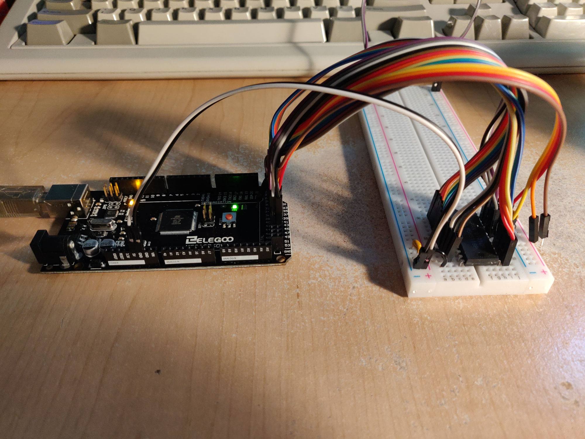
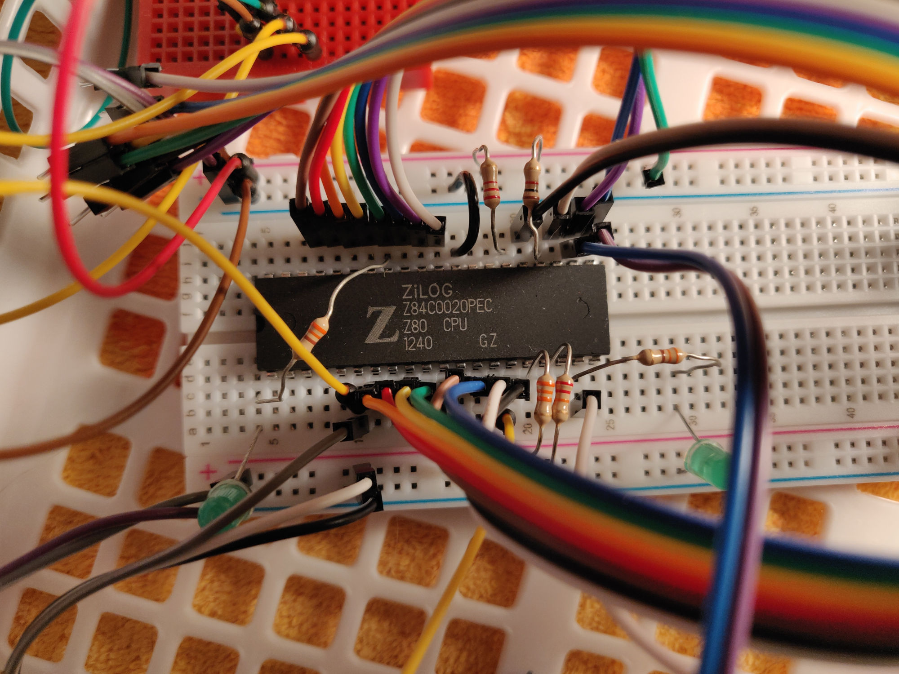
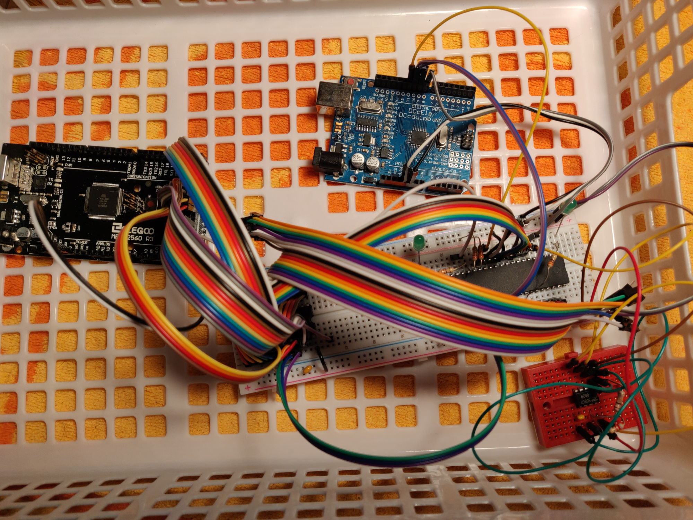
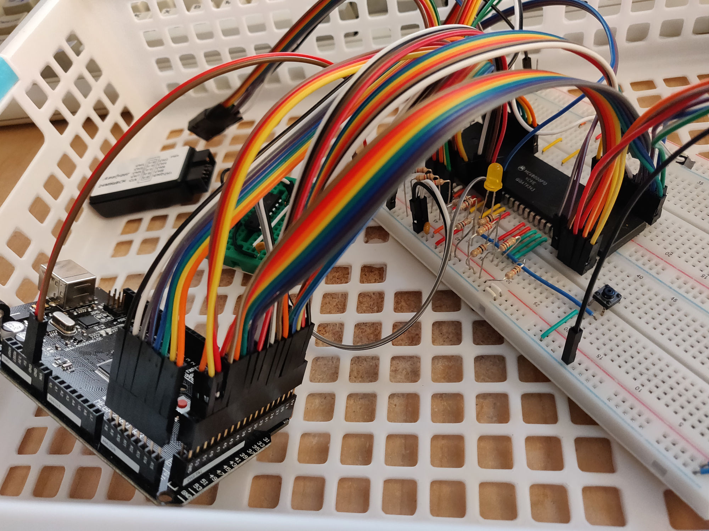
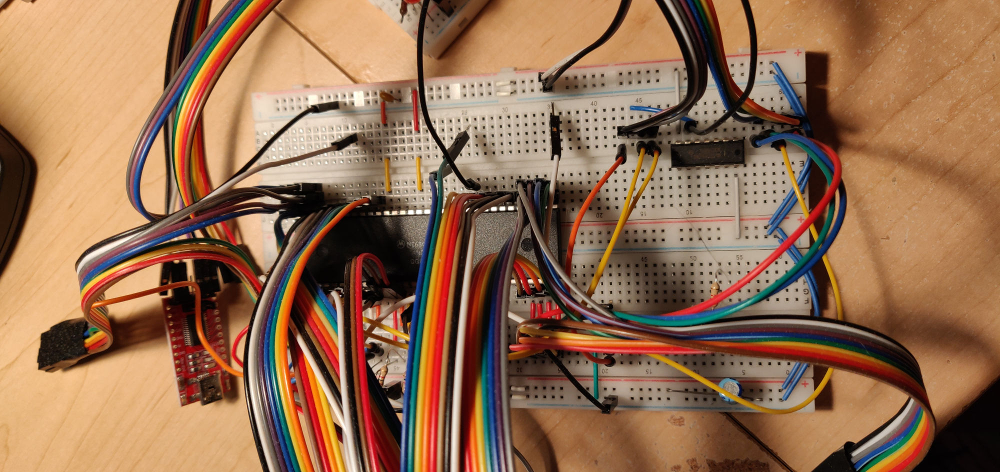
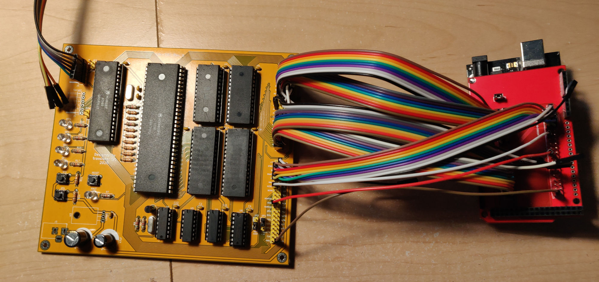

Bootstrapping a Homebuilt Computer Using An Arduino
===================================================

###### *Written September 2021*


Over the last couple of years I've been working on a series of projects to build my own computer
from scratch.  It had been a dream of mine when I first started learning about computers and
electronics to build my own computer, and I tried designing some on paper with what I knew, but such
a complex project was out of reach at the time.  I've learned so much in the many years since then
and after seeing the awesome project [PDP-11/Hack](https://www.5volts.ch/pages/pdp11hack/), I
thought you know, why not try fiddling with CPUs again and see how far I get, just for the fun of
it.

As I thought about how to approach the problem of getting a program into a minimal system built on a
breadboard, I thought perhaps I could use an Arduino Mega, with it's multitude of I/O pins.
Initially I thought I could use it to program a Flash or EEPROM chip separately, but after thinking
about it a bit, I realized I could program a RAM chip in the same circuit as the CPU.  What follows
is my journey towards building my first single board computer through incremental experimentation.

The Chips
---------

PDP-11/Hack is based around an old PDP-11 processor module that was bought online on Ebay.  I hadn't
thought about buying used parts online before since I didn't expect them to work, but that got me
searching around for what was available.  While Ebay had many used chips, especially the less common
ones, AliExpress had the best deals, with lots of old 8-bit CPUs, memory chips, and peripheral
controllers, sometimes for less than a dollar a chip.  I figured I'd order some and see if I could
get them working.  To my surprise, a fair number of the chips I received worked as expected, even
the ones that were clearly relabelled.  For more information on relabelled and counterfeit chips,
check out this great video about ["Fake Chips"](https://www.youtube.com/watch?v=k72SFBOZ_lw) by
David Viens, discussing this problem with popular audio synth chips.  In my various purchases of
used chips, the audio chips were most likely to be counterfeit due to the large demand for them and
the higher prices they fetch.  Some of the CPU and memory chips that I received were also
counterfeit but they tended to still be functional.  The date codes would often be changed, with
each chip in the lot having the same date code, and in the case of the memory chips, sometimes a
compatible memory chip of the same size would be relabelled as a more popular part number, such as
the popular HM628512 static RAM chip.

I ordered some Z80s, 6502s, 65816s, 68000s, 68010s, 8088s, and 8086s, as well as some peripheral
chips for each CPU, some memory chips, and various speeds of crystals.


The First Fiddlings
-------------------

While waiting for my first orders of chips to arrive, I searched though the various old chips that I
had scavenged from disassembled equipment over the years.  I happened to have a [Mitsubishi
M5M5118P](https://datasheet.octopart.com/M5M5118P-Mitsubishi-datasheet-154393393.pdf) Static RAM
chip on-hand, which is organized as 2 kilobytes of 8-bits.  I wired each address and data pin, as
well as the W (write) and S1 (chip select 1) pins, to pins on the Arduino Mega.  For the S2 (chip
select 2) pin, I wired it to ground so that only S1 needed to be brought low to start a transfer.
For the address and data pins, I made sure to use the [arduino
pins](https://www.arduino.cc/en/Hacking/PinMapping2560) that correspond to specific hardware port
registers so that I could write directly to the ATMega's PORTx registers to set all 8 bits at once.



The code first initializes the I/O pins.  Port A has the 8 data pins connected to it, with Port L
and C used for the upper and lower address pins respectively.  The chip select and write pins use
arduino `digitalWrite()` functions since we only need to set 2 bits per request, and it's a bit
easier to understand and edit than bit operations on the PORTG register.  (The `MEM_RD` pin is left
disconnected for the M5M5118P, but it is used by some chips, so I've left it in the code).
```cpp
#define MEM_CS      39      // PG2
#define MEM_RD      40      // PG1
#define MEM_WR      41      // PG0

// Address Bus
PORTL = 0x00;               // A8 - A15
DDRL = 0xFF;                // Configure as outputs
PORTC = 0x00;               // A0 - A7
DDRC = 0xFF;                // Configure as outputs

// Data Bus
PORTA = 0x00;               // D0 - D7
DDRA = 0x00;                // Configure the data bus as inputs by default

// Controls
pinMode(MEM_CS, OUTPUT);
pinMode(MEM_RD, OUTPUT);
pinMode(MEM_WR, OUTPUT);
digitalWrite(MEM_CS, 1);    // Each control signal is normally-high,
digitalWrite(MEM_RD, 1);    // active-low, so set them all to "high"
digitalWrite(MEM_WR, 1);    // to disable the chip
```

The data written to each memory address during the write test will be the lower byte of the address,
so the data returned should be a sequence of numbers from 0x00 to 0xFF
```cpp
PORTA = 0x00;
DDRA = 0xFF;                    // Set the PORTA pins to "output" mode
for (int i = 0; i < 2048; i++) {
    PORTL = (i >> 8);           // Set the upper address bits
    PORTC = 0x00FF & i;         // Set the lower address bits
    PORTA = (i & 0x00FF);       // Set the output data byte
    digitalWrite(MEM_WR, 0);    // Set the WR and CS pins to low to start a memory write
    digitalWrite(MEM_CS, 0);
    //delayMicroseconds(1);     // Optional delay for slower chips
    digitalWrite(MEM_WR, 1);    // Set the WR and CS pins high to end the memory write
    digitalWrite(MEM_CS, 1);
}
```

The data is then read back and printed to the arduino serial monitor.  When a byte is read that
doesn't match the lower byte of that address, it's recorded as an error and displayed at the end.
This will give us an indication if there was a glitch during reading or writing, or if the cell is
not working properly, although it's not a conclusive test because only one value is tested per cell.
```cpp
byte value;
int errors = 0;

PORTA = 0x00;
DDRA = 0x00;                    // Set the PORTA pins to "input" mode
for (int i = 0; i < 2048; i++) {
    PORTL = (i >> 8);           // Set the upper address bits
    PORTC = 0x00FF & i;         // Set the lower address bits
    digitalWrite(MEM_RD, 0);    // Start a memory read by setting CS and RD low
    digitalWrite(MEM_CS, 0);
    //delayMicroseconds(1);     // Optional delay for slower chips
    value = PINA;               // Read in the data and store in temporarily
    digitalWrite(MEM_RD, 1);    // Stop the memory read by setting CS and RD high
    digitalWrite(MEM_CS, 1);
    
    if (value != (i & 0x00FF))  // If the value isn't the expected value, record as an error
        errors += 1;
    Serial.print(value, HEX);   // Print the value read in hexadecimal
    Serial.print(" ");
    if (i % 64 == 63)           // Wrap the output line every 64 bytes for readability
        Serial.print("\n");
}

Serial.print("\n");
Serial.print("Errors: ");
Serial.print(errors, DEC);
Serial.print("\n");
```

The complete [MemTest](https://github.com/transistorfet/computie/blob/main/software/arduino/MemTest/MemTest.ino) code

I tried running this code on a few different memory chips and most chips had no errors.  When a chip
was broken, it would often contain either entirely random or all zero data and no cells would write.
After a while I started noticing glitches where a couple of cells would produce errors, but it would
often be different cells or different numbers of errors every time I tried to read.  After much
fiddling I found these were caused by poor electrical connections in the breadboard wiring.  This
was a frequent issue throughout this project, but it tended to be intermittent.  I would sometimes
go weeks without a problem, and then have constant glitches for days until I remembered to try
jiggling or rearranging the wires.

I had also gotten some EEPROM chips from AliExpress, which I ran the MemTest code on as well.  They
were quite cheap, so I figured it was worth a try, even though I expected the memory cells to be
worn out.  I was initially surprised that the EEPROMs did often save the data written to them, with
no or almost no errors when read back, with the exception of one batch of chips that were clearly
counterfeit and non-functional.  Sadly though, I found out with 68k-SBC Rev.0, which used the
EEPROMs, that the data would often disappear after a few hours or days.  Luckily I didn't need them
while testing Rev.0, so I didn't bother buying new EEPROMs from digikey, and I switched to Flash
chips for the next revision.


On To Z80s
----------

The Z80 CPUs I had ordered arrived first, so I started with them.  The Z80 has separate pins for the
address and data lines, which simplifies the wiring, and it also has a static core, so running it at
a very low frequency is possible.  I whipped up a simple oscillator using a 555 timer set to
somewhere around 80 Hz (yes singular Hz).


(This chip turned out to be relabelled.  The black paint on top comes off with acetone or alcohol,
the ejection holes show that it was sanded down, and the date codes of all 10 chips were identical,
despite being desoldered.  They are labelled as being 20MHz, but I never ran them above 1MHz.  They
are definitely a Z80 of some kind, and they worked alright for my experiments, but if you're looking
for a reliable part, beware what you buy)


The red breadboard has the 555 oscillator on it, and the the other chip with lots of wires going to
it is a memory chip.  The Arduino Uno clone in the picture is being used as a logic analyzer, while
I was waiting for the generic analyzer I had ordered to arrive.

I had originally thought I would program the RAM chips in-circuit with the CPU.  I could use the
CPU's bus arbitration signals to disconnect it from the shared bus while the arduino was writing to
the RAM, and then configure the arduino pins as inputs to effectively disconnect them from the bus
while CPU had control.  While that did work, I realized that perhaps I could directly intercept the
bus requests if the CPU was slow enough, and directly feed bytes of data to the CPU without the
extra step of writing the data to RAM first.  The arduino could assert the WAIT signal to the CPU to
delay the request until it was ready to complete, thus taking as long as it needed to process the
request.  I wouldn't necessarily need a RAM chip at all, and it would make it faster to test an
updated Z80 program.

In order to intercept the transfer, I set up a pin change interrupt in the arduino for the MREQ
input from the CPU, which goes low whenever a byte is read or written by the CPU.  The interrupt
handler would then assert the WAIT signal and check the MREQ, RD and WR signals to figure out what
to do.  In the arduino, there was a large array used as the "virtual" memory.  It could be
pre-initialized with a Z80 program, and any read or write requests would read or write the
corresponding location in the array.  Since the WAIT signal was asserted throughout this, the
arduino could take as much time as it liked, so it was possible to print out debug information to
the arduino's serial monitor.  It would print the address being accessed and the data value either
fetched or written by the bus request.  From this I could see that the CPU was actually executing
the program step by step, and trace which program address was fetched next to confirm the jump and
call instructions were executing as expected.

```cpp
#define Z80_HADDR_PORT  PORTC
#define Z80_HADDR_PIN   PINC
#define Z80_HADDR_DDR   DDRC

#define Z80_LADDR_PORT  PORTL
#define Z80_LADDR_PIN   PINL
#define Z80_LADDR_DDR   DDRL

#define Z80_LDATA_PORT  PORTA
#define Z80_LDATA_PIN   PINA
#define Z80_LDATA_DDR   DDRA

#define Z80_IS_MREQ()   (!(PINB & 0x01))
#define Z80_IS_RD()     (!(PINB & 0x02))
#define Z80_IS_WR()     (!(PINB & 0x04))

#define Z80_SET_WAIT()  ((PINB | 0x08))
#define Z80_CLR_WAIT()  ((PINB & 0xF7))

word mem_size = 4096;
byte mem[4096] = {
// The Makefile that compiles the Z80 program will format the binary as
// C-compatible text which is #included here, so that whenever this arduino
// code is uploaded, it will have the latest Z80 binary image
#include "../Z80Monitor/output.txt"
};

// This interrupt will only be enabled when the CPU is running
// and the arduino is listening for requests ("device" mode)
ISR (PCINT0_vect)
{
    PCICR = 0x00;       // Disable pin change interrupts

    if (Z80_IS_MREQ() && Z80_HADDR_PIN < 0x20) {
        Z80_CLR_WAIT();                     // Assert the wait signal

        // CPU Read Operation
        if (Z80_IS_RD()) {
            register word addr = (Z80_HADDR_PIN << 8) | Z80_LADDR_PIN;
            Z80_LDATA_DDR = 0xFF;           // Configure data bus pins as output

            #if BUS_DEBUG                   // Print debug information
            Serial.write('R');
            Serial.print(addr, HEX);
            if (addr < mem_size) {
                Serial.write('|');
                Serial.print(mem[addr], HEX);
            }
            Serial.write('\n');
            #endif

            if (addr < mem_size)
                Z80_LDATA_PORT = mem[addr]; // Output the requested byte
            else
                Z80_LDATA_PORT = 0x00;      // Output 0 for all other addresses

            Z80_SET_WAIT();                 // Clear the wait signal
            while (Z80_IS_MREQ()) { }       // Wait until the CPU ends the MREQ
            Z80_LDATA_PORT = 0x00;
            Z80_LDATA_DDR = 0x00;           // Configure data bus pins as inputs
        }
        // CPU Write Operation
        else if (Z80_IS_WR()) {
            register word addr = (Z80_HADDR_PIN << 8) | Z80_LADDR_PIN;

            #if BUS_DEBUG                   // Print debug information
            Serial.write('W');
            Serial.print(addr, HEX);
            Serial.write('|');
            Serial.print(Z80_LDATA_PIN, HEX);
            Serial.write('\n');
            #endif

            if (addr < mem_size)
                mem[addr] = Z80_LDATA_PIN;  // Save the byte from the data bus

            Z80_SET_WAIT();                 // Clear the wait signal
            while (Z80_IS_MREQ()) { }       // Wait until the CPU ends the MREQ
        }
    }

    PCIFR = 0x00;       // Clear pin change interrupt flag
    PCICR = 0x01;       // Enable pin change interrupts
}
```

Check out the
[Z80 Supervisor](https://github.com/transistorfet/computie/blob/main/hardware/Z80-NQC/Z80Supervisor/Z80Supervisor.ino)
code for more details

Next I added a check for the IOREQ signal, which would respond to specific IO port addresses.  When
writing to IO port 0xFF, it would either set or reset the arduino LED based on whether 0x00 was
written or not.  To test it, I made a simple Z80 program that used the `out` instruction to output 1
to the LED port, which confirmed that the IOREQ code was working and the Z80 was running.  Then I
added a check for port 0xF1, which would send the byte written by the CPU to the arduino's serial
monitor.  The following Z80 program could then be run to print a message to the serial monitor!

The first Z80 program, welcome.asm, which was compiled using SDCC's assembler
```nasm
    org 0000h         ; After a reset, the Z80 starts executing at 0x0000
    jp  start

start:
    ld   sp, 0200h    ; Set the stack pointer to an area above the program
    call _main
    halt

_main:
    ld  a, 01h
    out (00FFh), a    ; Output 1 to our arduino LED control port to turn it on

    ld  de, msg       ; Load the address of the message to print

loop:
    ld  a, (de)       ; Load the byte at message address
    cp  0             ; If it's a null character, jump to loop_end
    jp  Z, loop_end
    out (00F1h), a    ; Output the character to arduino serial
    inc de
    jp  loop

loop_end:

    ret               ; End of _main

msg:    defm    "Welcome To Bread80!\n\n\0"
```

[Z80 Monitor](https://github.com/transistorfet/computie/blob/main/hardware/Z80-NQC/Z80Monitor/)
for more Z80 code and build files

I was able to get some C code compiled and running using SDCC, but I was starting to get more
glitches, and timing issues.  The low speed of the CPU was also becoming a hindrance, but the
arduino was not able to assert the wait signal in time at higher CPU speeds.  The arduino is not
that much faster than the CPU, and the interrupt contains a lot of overhead before the wait signal
is asserted.  I considered using a flip flop to lock in the wait signal whenever a memory request
was initiated, which would be reset by the arduino when it had completed its checks, but that would
involve a bunch more wiring, which was already a bit flakey, and I was aiming for minimal external
hardware.

There were a lot of wires at this point and poor connections were becoming a problem again.  I tried
using a section of the breadboard as a patch panel to distribute the data and address signals, but
some of the breadboard pins got damaged after I inserted some of the wires at the wrong angle.  I
lost a lot of time trying to figure out why the program was not executing as expected, before I
realized it was caused by the damage to the breadboard.  The fact that all the wires were still
joined together in bundles of 8 or 12 also caused issues since they couldn't move relative to each
other, and the tension caused by this would pull out some of the wires, causing poor connections.


Add Simplicity
--------------

With the concept of intercepting the bus request proven, I set about making a much simpler
breadboard setup without memory chips.  By this point, I had homed in on the 68000 as the CPU to
push forward with.  It would have more processing power and addressable memory than most of the
8-bit CPUs, which would come in handy when I eventually tried writing an OS, and it required
significantly less external circuitry than the 8086/8088, since the address and data buses are not
multiplexed like they are on the 8086/8088.  The 68000 also has an asynchronous bus, which uses the
DTACK signal to indicate the end of the request, rather than a WAIT signal to delay the end of the
request.  This means I could avoid the need for a flip flop to lock in the wait state.

I started by wiring up a 68000 directly to the arduino pins, along with the necessary pull-up
resistors for the control signals.  A simple 74HC14-based crystal oscillator provides the clock
signal (on the mini green breadboard).  The 68000 needs a clock that is at least 4 MHz, or else the
dynamic registers used in the CPU will lose their values and cause the CPU to misbehave, but running
at such a fast speed wont be a problem here, because of the asynchronous bus.  I ended up running it
at 8 MHz without issue.  The actual execution speed was limited by the arduino's response time,
which was often more than 1 microsecond per instruction.  No other memory or interfacing chips are
needed for a minimal system, besides the arduino.


Note the extra wire bundles and the generic logic analyzer in the upper left corner.  This turned
out to be very handy indeed.  I used Logic 1.2.18 from Saleae to capture various control and data
pins to debug various issues I came across.  I also purchased a new oscilloscope, which helped a
lot for a few tricky problems, especially with the later PCBs.

The 68000 starts a bit differently than the Z80.  I didn't realize this at first and had some
trouble trying to get it to run as expected until I read the manual closer.  At the start of memory
is an interrupt vector table from 0x000000 to 0x000400, with 256 entries of 4 bytes each.  Each 4
bytes specifies a 32-bit address which should be loaded into the program counter when the
corresponding interrupt occurs.  The exception to this is the first entry in the table which is the
address to be loaded into the stack register upon reset.  The second entry contains the program
counter on reset.  The 6 entries after contain the location of the error handlers for common program
errors such as "Illegal Instruction" and "Bus Error".  While testing on the breadboard and arduino
(with its limited memory), I only reserved space for the first 8 entries in the vector table, and
put the program in the remaining space, since those other interrupts would not occur during a simple
program.  This worked fine for testing.

This interrupt vector table is always located at address 0x000000 on the 68000, but on the 68010, it
can be changed after reset using the special `IVR` register.  I later switched to the 68010 when
developing the OS in order to use this feature.  

The first 68k program, welcome.s, compiled with GCC 9/10 for m68k.  Note the assembly syntax here is
quite different.  Register names are preceded with a `%` character and data is moved from the
left-hand location to the right-hand location, so `move.b #0x01, %d1` loads the D1 register with the
value 0x01.  The comments should also start with `|` but I changed them to `;` for the code
formatter here.
```asm
    .org    0x0000          ; After reset, the 68k expects the interrupt vector table here

    .word   0x0000          ; stack pointer value loaded on reset
    .word   0x1000
    .word   0x0000          ; PC value loaded on reset
    .word   0x0020

    .org    0x0020          ; Reserve space for the first 8 interrupt vectors
_start:

    move.b  #0x01, %d1
    lea     0x20ff, %a1     ; Load the address of the LED register
    move.b  %d1, (%a1)      ; Write 0x01 to turn the LED on

    lea     message, %a1    ; Load the message address
    lea     0x20f1, %a2     ; Load the address of serial output register

loop:
    move.b  (%a1)+, %d2     ; Load the next character and increment the pointer
    move.b  %d2, (%a2)      ; Write the character to serial

    cmpi.b  #0x00, %d2      ; Loop until the null character is found
    bne     loop

    stop    #0x2700         ; Halt the CPU

message: .ascii "Welcome to Bread68k!\n\n\0"
```
The 68000 uses memory-mapped IO so the arduino program recognizes the addresses 0x2000 - 0x20FF as
IO registers.  The 0x20FF register is used for the LED, and the 0x20F1 register for serial bytes.

[68k Supervisor](https://github.com/transistorfet/computie/blob/main/software/arduino/68kSupervisor/68kSupervisor.ino)
is the arduino code.  It's a bit messy since it has involved a lot of trial and error while
debugging problems, and changes as I've experimented with different chips.  The code is now only
really used to load an initial program into the onboard Flash chips of the newer 68k-SBC and 68k-SMT
boards.

When the Supervisor first runs, it will start in "device" mode (as if it were a device connected to
the CPU's bus), and allow the CPU to run freely.  While the CPU is running, any input to the serial
monitor will be made available if the CPU reads the memory-mapped IO address for serial bytes.  To
escape out of the input-capture mode, a single backtick "&#x60;" character followed by enter can be
typed, which will cause the arduino to request the CPU bus through the bus arbitration signals, and
enter "controller" mode.  In controller mode, the CPU will be suspended, and in the serial monitor a
prompt will be displayed which responds to some simple commands, such as `run` to start the cpu and
`reset` to reset it.  The memory chip tests can be run from the command prompt as well.  I've mostly
hand-changed the address and size values used by the memory tests as needed rather than allowing
them to be specified in the command.


Adding Serial via MC68681
-------------------------

The ultimate goal was a standalone computer on a custom PCB, so I needed an IO device that wasn't
the arduino.  The obvious choice was the MC68681 chip, which is designed to interface easily to the
68000, and which is still widely available.  It has 2 serial ports, 6 general purpose input pins,
and 8 general purpose output pins.  Some of these GPIO pins are needed for the serial port CTS and
DTR flow control signals (which turned out to be crucially important for sending large amounts of
data over the serial ports), but some could be used for debugging as well.  Before getting a circuit
board printed, I wanted to make sure all the parts of the complete design would work as expected.  

I assembled a circuit on a separate breadboard, and wired it to the data and address buses.  I also
added an inverter to address line A14 which would go low whenever an address in the 0x4000 range was
accessed, which I could use as the chip select signal for the MC68681.  The serial port pins were
wired to an FTDI module (the small red circuit board in the images) with ground pin connected to the
system ground, and the power pin unconnected.  The CPU and MC68681 were powered by the Arduino Mega,
which was powered through its USB port.

<div align="center">

</div>
The MC68681 on a half-sized breadboard, with an FTDI Serial-to-USB adapter (the red circuit board)
wired to the serial pins.  The red LED and a push button are wired to GPIO pins for debugging.


The main breadboard at this point, with the serial board just out of frame.  The logic chip on the
right is a 74HC14 hex inverter used for decoding the address for the MC68681.

By this point, I had a simple C program that would run on the breadboarded 68k, and use the MC68681
to output text via the FTDI module to a serial terminal program, which was running on my desktop.
The code for the monitor at this point in time can be seen
[here](https://github.com/transistorfet/computie/tree/37a3d22eb2dc59042ab9b4293cf30fd41935a81a/68k-SBC/68kMonitor/src).
I was already starting to implementing some of the standard C library functions for formatting
numbers and strings, so that I could easily print out debug information to the serial terminal


The First PCB
-------------

While experimenting with the 68k on a breadboard, I started working on the PCB design in KiCad for a
system that could run without the arduino, 68k-SBC Rev.0.  (Note: I started with revision numbers
from 0 but later decided I should start from 1 instead, so I skipped Rev.1, and the second version
after this board is named Rev.2).  The board has the MC68681 with headers for FTDI modules, since I
didn't plan on using actual RS-232 connectors with it.  It has 2 x 512KB static RAM chips for the
upper and lower byte, mapped to address 0x100000, as well as 2 x 32KB EEPROMs, mapped to address
0x000000.  There are also 2 x 40 pin headers for all the address, data, and control signals, so that
I could hook up the arduino to it.  To make this easier with so many wires, I also designed an
arduino shield with matching 2 x 40 pin headers wired to the appropriate arduino pins so that I
could use ribbon cables to connect them instead of individual wires.  That said, I didn't actually
use the ribbon cables until Rev.2 so that I could access the unwired control pins for further
testing and expansion.



This board also has two jumpers in the lower right corner.  One will enable or disable the onboard
DTACK generation.  With it disabled, the ardunio can provide the DTACK instead, giving it a chance
to print each memory request, even if the CPU is reading data from a memory chip.  The other jumper
will move the address of the EEPROM from 0x000000 to 0x200000.  This allows the arudino to respond
to addresses in the 0x000000 range, which is where the boot vector table is, allowing it to boot the
CPU without the EEPROMs.  The EEPROMs can also be programmed while in the 0x200000 address range.

There were various issues with this board and it wasn't long before I moved on to the next revision,
but I'll save that for another post.

End of the Beginning
--------------------

It's been such a fun and rewarding experience playing around with old CPUs again.  Using an arduino
to bootstrap the process made it a lot easier to experiment and test things out quickly.  From the
time I started playing around with memory chips in October of 2019, and working a full time job, I
had a working single board standalone computer by the end of March 2020.  From there, I started
writing a proper operating system and made a few upgraded versions of the same system.  While I've
been spending time on other projects lately, I plan to eventually push further with MC68030s and
perhaps more.  I hope this inspires others to give it a try and get started in their own experiments
with these wonderful classic CPUs.

