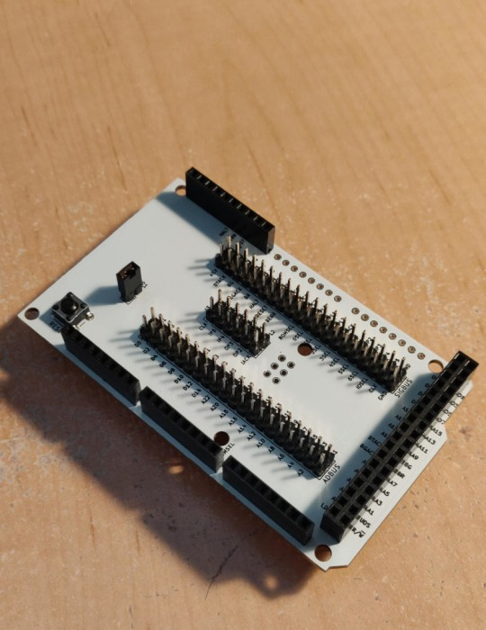

68k-Supervisor
==============

Status: Built & Tested

Latest: Rev.2

### About
An arduino shield for the Arduino Mega 2560 with two 40-pin connectors that match the two 40-pin
expansion headers of the computie single board computers (68k-SBC, 68k-SMT, and k30-SBC with
rework).

### 68k-SBC and 68k-SMT

Use the [68kSupervisor](../../software/ardunio/68kSupervisor) sketch to program the flash
in-circuit, debug the CPU, or host memory and serial I/O access via the memory bus.  Make sure to
set the 68k-* board jumpers correctly for DTACK and the RAM location if debugging or hosting with
the supervisor.

### k30-SBC

This PCB requires some changes before it can be used with the k30-SBC:
    - Address 0 on the ADBUS 40-pin connector (Pin 39) should be wired to Digital Input #9 (D9) of the
      Arudino
    - the WR pin on the SIGBUS 40-pin connector (Pin 14) should be wired to Digital Input #8 of the
      Arudino (D8).  It was a duplicate of R/W on the 68k-* boards, but it's now the DS (data strobe)
      signal from the 68030 on the k30-SBC
The [k30FlashWriter](../../software/ardunio/k30FlashWriter) sketch should be used, which will only
allow running or suspending the CPU, and writing to the flash chip in-circuit to bootstrap the
board.  The debugging feature has been removed since it didn't work correctly at the 12MHz speed
that the 68030 is running at.  The k30 board only has one 512kB of flash in a single 8-bit wide
chip, instead of two flash chips in parallel to fit the 16-bit interface of the 68010 that the 68k-*
boards have, which is why this alternate flash writing sketch is needed.  The reworked shield can
still work with the 68kSupervisor sketch to communicate with the 68k-* boards.

[Revision 2 Schematic](revisions/68kBoardSupervisorShield-rev2.pdf)

[Revision 2 Gerbers](revisions/68kBoardSupervisorShield-rev2.zip)

